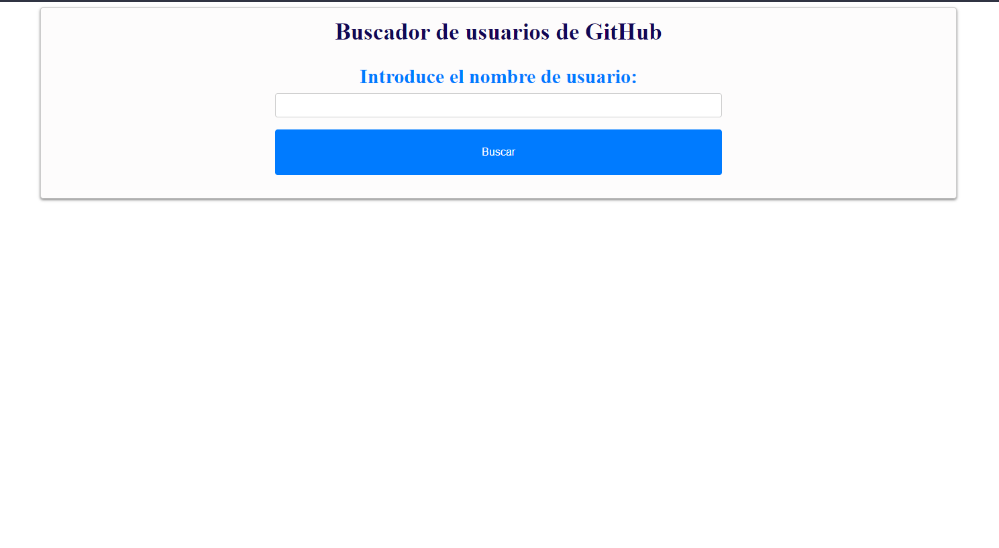

# Buscador_de_usuarios_de_GitHub
Buscador de usuarios de GitHub CON API de Github, HTML, CSS y Javascript

Buscador de usuarios de GitHub que permite buscar usuarios y ver su información pública, como el nombre de usuario, la ubicación, la biografía, la imagen de perfil, Con un Link a su Perfil de GitHub, fue relizada usando la API de GitHub https://api.github.com/search/users?q=${username}, con HTML, CSS Y Javascript, y algunos parametros para visualizar la informacion.

## URL DEL PROYECTO: https://juancitopena.github.io/Buscador_de_usuarios_de_GitHub/

## Captura de Pantalla 1

## Captura de Pantalla 2

## Captura de Pantalla 3

